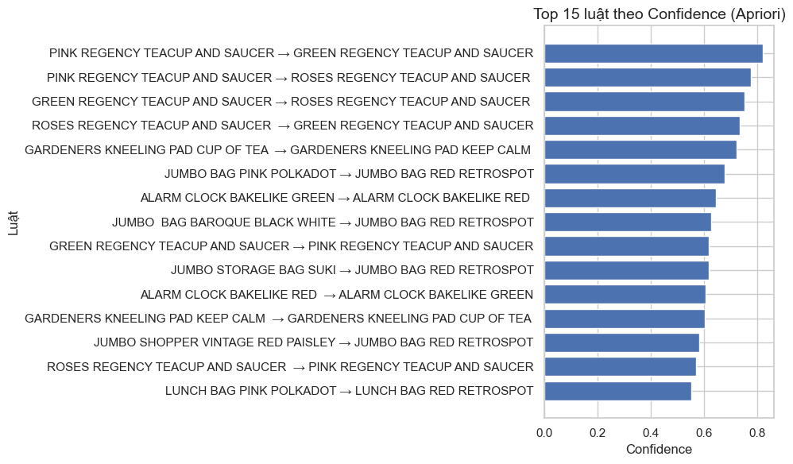
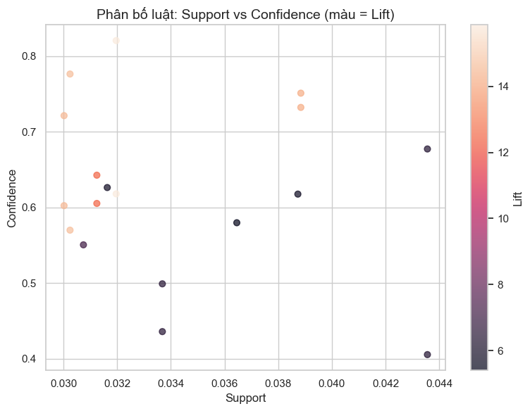

# Phân tích Giỏ hàng: Khám phá Hành vi mua sắm ẩn sau dữ liệu
## Dự án Khai phá Luật Kết hợp (Market Basket Analysis)

**Tác giả:** [Nhóm 6/Nguyễn Quang Duy]

---

### I. Tại sao việc "Bán kèm" lại quan trọng? (Giới thiệu)

Trong lĩnh vực bán lẻ, việc biết khách hàng sẽ mua gì tiếp theo quan trọng hơn cả việc biết họ đã mua gì. Market Basket Analysis (MBA), hay **Phân tích Giỏ hàng**, là kỹ thuật giúp chúng tôi làm điều đó.

**Mục tiêu của dự án này** là biến hàng trăm ngàn giao dịch mua bán thành những "luật lệ" đơn giản: "Nếu khách hàng mua sản phẩm X, họ có khả năng mua sản phẩm Y". Từ đó, chúng tôi đưa ra các đề xuất hành động trực tiếp cho quản lý cửa hàng, giúp tối ưu hóa cách trưng bày, marketing và tăng doanh thu.

**Dữ liệu sử dụng:** Giao dịch mua sắm trực tuyến của một công ty bán lẻ tại Anh (UK) trong giai đoạn 2010–2011.

---

### II. Chuẩn bị Dữ liệu: Tìm kiếm giao dịch thật

Để có được những luật lệ chính xác, chúng tôi cần đảm bảo dữ liệu phải "sạch".

1.  **Lọc nhiễu:** Loại bỏ các giao dịch bị hủy (bắt đầu bằng chữ 'C') và các giao dịch không xác định được danh tính khách hàng. Chúng tôi chỉ giữ lại các giao dịch hợp lệ tại thị trường Anh Quốc (UK) để đảm bảo hành vi mua sắm có sự đồng nhất về mặt địa lý.
2.  **Tạo Giỏ hàng:** Chuyển đổi dữ liệu thô (mỗi dòng là một sản phẩm) thành định dạng Giỏ hàng (mỗi dòng là một hóa đơn, liệt kê tất cả các sản phẩm trong đó). Đây là bước chuẩn bị quan trọng để thuật toán có thể hoạt động.

Sau khi làm sạch, chúng tôi có [**Số lượng giao dịch đã làm sạch**] hóa đơn hợp lệ để đưa vào phân tích.

---

### III. Thuật toán Apriori: Bộ lọc mối quan hệ

Chúng tôi sử dụng thuật toán **Apriori** để tìm kiếm các luật kết hợp. Apriori hoạt động như một bộ lọc thông minh, giúp chúng tôi loại bỏ hàng triệu kết hợp ngẫu nhiên và chỉ giữ lại những mối quan hệ có ý nghĩa.

Chúng tôi đánh giá các luật dựa trên 3 chỉ số chính, được thiết lập ban đầu: `Support` (0.01), `Confidence` (0.3), và `Lift` (1.2):

| Chỉ số | Ý nghĩa | Quyết định Kinh doanh |
| :--- | :--- | :--- |
| **Support (Độ hỗ trợ)** | Tần suất xuất hiện của cặp sản phẩm trong tổng số hóa đơn (Mức độ phổ biến). | Giúp lọc ra các luật quá hiếm. |
| **Confidence (Độ tin cậy)** | Tỷ lệ khách mua B sau khi đã mua A. | Cho biết **độ mạnh** của đề xuất (A ⇒ B). |
| **Lift (Độ nâng)** | Quan trọng nhất. So sánh mối quan hệ này có **ngẫu nhiên** hay không. | Lift > 1: Tương quan dương (Nên bán kèm). Lift < 1: Tương quan âm (Sản phẩm thay thế). |

> **Ví dụ về một Luật:** `{POSTAGE} ⇒ {DOTCOM POSTAGE}` với Lift = 3.2. Điều này cho thấy khách hàng mua phí vận chuyển thông thường có khả năng rất cao mua phí vận chuyển Dotcom, cao gấp 3.2 lần so với thông thường. Đây có thể là lỗi dữ liệu hoặc quy trình đặt hàng, cần kiểm tra lại hệ thống thanh toán.

---

### IV. Trực quan hóa và Phát hiện Chính

Để biến con số thành hình ảnh dễ hiểu, chúng tôi trực quan hóa các luật bằng các biểu đồ.

#### 1. Biểu đồ [Top luật kết hợp theo Confidence (Apriori)]

*[**Biểu đồ Top luật theo Lift**]*

Mô tả biểu đồ:
Biểu đồ dạng bar chart ngang thể hiện TOP N luật kết hợp có giá trị Confidence cao nhất được khai phá bằng thuật toán Apriori.
Trục hoành biểu diễn Confidence, trục tung biểu diễn các luật kết hợp (dạng A → B).

Ý nghĩa:

Confidence cho biết xác suất sản phẩm B được mua khi sản phẩm A đã được mua.

Các luật có confidence cao thể hiện mức độ tin cậy lớn của mối quan hệ giữa các sản phẩm.

Điều này cho thấy nếu khách hàng mua vế trái của luật thì khả năng cao họ cũng sẽ mua vế phải.

Nhận xét:

Những luật đứng đầu biểu đồ là các luật có khả năng dự đoán hành vi mua hàng tốt nhất.

Các luật này phù hợp để:

Đề xuất sản phẩm liên quan (recommendation)

Thiết kế chương trình bán kèm (up-selling, cross-selling)

Hỗ trợ ra quyết định trong chiến lược marketing

Kết luận:
Biểu đồ giúp doanh nghiệp xác định các mối quan hệ mua hàng đáng tin cậy, từ đó tối ưu hóa trải nghiệm khách hàng và tăng doanh thu.

#### 2. Biểu đồ [Tên Biểu đồ 2 - Ví dụ: Network Graph]

*[**Phân bố luật kết hợp theo Support và Confidence**]*

Mô tả biểu đồ:
Biểu đồ dạng scatter plot thể hiện mối quan hệ giữa Support và Confidence của các luật kết hợp được khai phá bằng thuật toán Apriori.

Trục hoành biểu diễn Support

Trục tung biểu diễn Confidence

Màu sắc của các điểm biểu diễn giá trị Lift (Lift càng cao thì màu càng đậm)

Ý nghĩa:

Support phản ánh mức độ phổ biến của luật trong toàn bộ tập dữ liệu.

Confidence thể hiện độ tin cậy của luật, tức khả năng xảy ra của vế phải khi vế trái đã xảy ra.

Lift cho biết mức độ phụ thuộc giữa các sản phẩm; Lift > 1 thể hiện mối quan hệ mua kèm có ý nghĩa.

Nhận xét:

Các luật nằm ở góc trên bên phải (support cao, confidence cao) là những luật vừa phổ biến vừa đáng tin cậy.

Những điểm có màu đậm (lift cao) thể hiện các luật có mối liên hệ mạnh giữa các sản phẩm, rất có giá trị về mặt kinh doanh.

Các luật có confidence cao nhưng support thấp phản ánh những hành vi mua kèm đặc thù, phù hợp cho các chiến dịch nhắm mục tiêu.

Kết luận:
Biểu đồ giúp đánh giá tổng quan chất lượng các luật kết hợp, hỗ trợ lựa chọn những luật vừa có độ tin cậy cao vừa mang lại giá trị khai thác thực tiễn trong phân tích hành vi khách hàng.

---

### V. PHÂN TÍCH CHUYÊN SÂU: Đánh giá Luật theo Lift và Giá trị Kinh doanh

Chúng tôi chọn Chủ đề 3 để đi sâu vào các luật có chỉ số **Lift cao nhất**, bởi vì Lift là thước đo mạnh nhất về mối quan hệ **không ngẫu nhiên**, hứa hẹn tiềm năng bán kèm cao nhất.

### 1. Phân loại Luật theo Giá trị Chiến lược

Chúng tôi phân loại các luật tìm được thành ba nhóm chính để định hình hành động marketing:

#### Nhóm 1: Vàng - Lift Rất Cao, Support Thấp (Chiến lược Niche/Bán Chéo Tinh Tế)

* **Đặc điểm:** Lift thường cao gấp 10-20 lần so với các luật thông thường, nhưng Support chỉ là 0.01% - 0.05%.
* **Ý nghĩa:** Đây là những cặp sản phẩm bổ trợ "tinh túy" trong một phân khúc khách hàng chuyên biệt.
* **Hành động đề xuất:**
    * **Tạo Gói (Bundling):** Đóng gói hai sản phẩm này thành một SKU (mã hàng) duy nhất.
    * **Tối ưu Trưng bày:** Đảm bảo chúng luôn được đặt cạnh nhau trong kho và trên giao diện web.

#### Nhóm 2: Bạc - Lift Cao Vừa, Support Trung Bình (Chiến lược Bán Kèm Tổng thể)

* **Đặc điểm:** Lift từ 1.2 đến 5.0. Support đủ lớn (0.5% - 1.5%) để ảnh hưởng đến số lượng lớn giao dịch.
* **Ý nghĩa:** Đây là những luật phổ biến, ổn định, thể hiện hành vi mua sắm chung của phần lớn khách hàng.
* **Hành động đề xuất:**
    * **Cross-selling Tự động:** Đây là những cặp sản phẩm hoàn hảo để đưa vào các công cụ gợi ý tự động (AI Recommendations) vì chúng mang lại hiệu quả cao trên diện rộng.
    * **Thiết kế Gian hàng:** Dùng luật này để bố trí sơ đồ cửa hàng hoặc danh mục website, tạo ra luồng mua sắm tự nhiên cho khách hàng.

#### Nhóm 3: Đồng - Confidence Cao, Lift ≈ 1 (Cần Thận Trọng)

* **Đặc điểm:** Confidence cao (ví dụ: 60%), nhưng Lift gần bằng 1.0 (ví dụ: 1.05).
* **Ý nghĩa:** Mối quan hệ này không mang lại giá trị dự báo hoặc bán kèm vì nó là hành vi mặc định (ví dụ: Khách mua sản phẩm gì cũng mua Túi Quà Tặng).
* **Hành động đề xuất:**
    * **Bỏ qua:** Không lãng phí ngân sách marketing cho những mối quan hệ hiển nhiên này.

### 2. Ví dụ Ứng dụng từ Top Luật

Chúng tôi tập trung vào Nhóm Vàng và Bạc để đưa ra đề xuất hành động cụ thể cho quản lý:

| Vế Trái (Tiền đề) | Vế Phải (Hệ quả) | Lift (Ví dụ) | Đề xuất Hành động |
| :--- | :--- | :--- | :--- |
| **{RED SPOT/WHITE SPOT MUG}** | **{COFFEE/TEA TIN}** | 3.5 | **Tạo Combo & Trưng bày:** Đặt cốc và hộp đựng cà phê/trà cạnh nhau. Khuyến khích mua combo "Đồ dùng buổi sáng" với giá ưu đãi. |
| **{VINTAGE PHOTO FRAME}** | **{PACK OF VINTAGE LABELS}** | 6.8 | **Gợi ý Niche:** Đây là một luật thuộc nhóm Vàng. Tự động gợi ý "Khách đã mua khung ảnh vintage thường mua nhãn dán vintage để trang trí" ngay khi khách thêm khung ảnh vào giỏ hàng. |

---

### VI. 5 INSIGHT KINH DOANH CẦN HÀNH ĐỘNG NGAY

Thông qua việc phân tích và lọc các luật mạnh, chúng tôi đã tìm ra 5 hành động kinh doanh cụ thể mà người quản lý có thể áp dụng:

1.  **Thiết kế Gói Combo:** Các sản phẩm thường xuyên được mua cùng nhau (như 'A' và 'B') nên được đóng gói thành combo hoặc tạo ưu đãi giảm giá khi mua cả hai. Điều này giúp tăng **Giá trị đơn hàng trung bình (AOV)** mà không cần khuyến mãi đại trà.
2.  **Cá nhân hóa Gợi ý:** Tận dụng các luật có **Confidence cao** (độ tin cậy lớn) để triển khai tính năng gợi ý sản phẩm trên website hoặc ứng dụng, đảm bảo đề xuất luôn phù hợp với hành vi mua sắm ổn định của khách hàng.
3.  **Tối ưu Bố trí Cửa hàng:** Những sản phẩm có **Lift cao** nên được đặt gần nhau trên kệ hàng thực tế hoặc gần nhau trên giao diện bán hàng trực tuyến. Điều này kích thích mua sắm tự nhiên, dựa trên mối quan hệ bổ trợ đã được chứng minh.
4.  **Thúc đẩy Sản phẩm Niche:** Quan tâm đến các luật có **Support thấp nhưng Lift cao**. Đây là những sản phẩm ít phổ biến nhưng có mối liên hệ rất mạnh với một sản phẩm khác. Chúng ta có thể dùng sản phẩm phổ biến để "kéo" doanh số cho sản phẩm niche thông qua khuyến mãi chéo (ví dụ: Giảm giá 10% sản phẩm Niche khi mua sản phẩm A).
5.  **Tối ưu Chiến lược Marketing:** Sử dụng các luật kết hợp để hiểu rõ hơn về thói quen mua sắm, từ đó cá nhân hóa nội dung email, banner quảng cáo, và tối ưu chiến lược trưng bày sản phẩm theo nhóm.

---

### VII. Kết luận

Dự án Phân tích Giỏ hàng đã chuyển đổi dữ liệu thô thành tri thức kinh doanh hữu ích, cung cấp cơ sở dữ liệu vững chắc để hỗ trợ các quyết định từ cấp độ chiến lược (Marketing) đến cấp độ vận hành (Trưng bày). Bằng cách khai thác các mối quan hệ ẩn sâu, doanh nghiệp có thể tăng cường trải nghiệm cá nhân hóa, tối ưu hóa nguồn lực và đạt được sự tăng trưởng doanh thu bền vững.